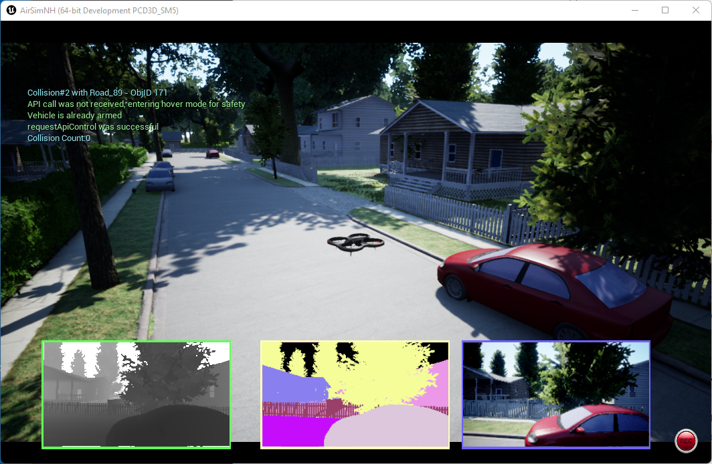

# airsim-js-drone-mission
This project demonstrates the use [airsim-js](https://github.com/ros2jsguy/airsim-js) with a [behavior-tree](https://github.com/6RiverSystems/blueshell) to fly a AirSim drone mission. 

